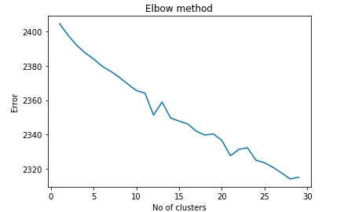
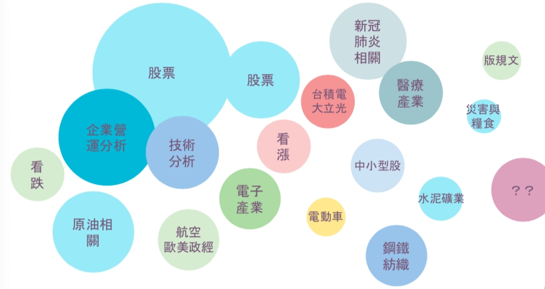
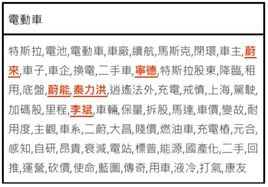
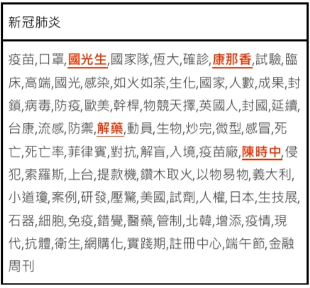
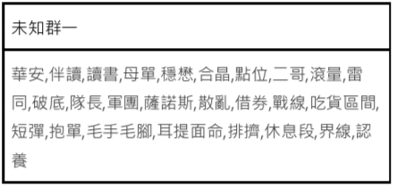
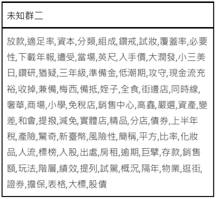
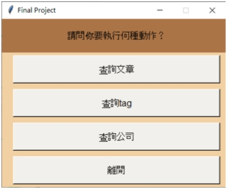

# PTT_Tag
為PTT增添更多功能
 

## 動機與目的
+ PTT 無法根據文章及其內容進行搜尋
+ PTT 現存的文章分類為人工標記，缺少自動主題分類、相關文章推薦
+ 替 PTT 的文章分群，添加與內文相關的主題標籤
+ 建立主題式的文章瀏覽，使用者看完文章之後，能夠顯示該文章的主題標籤與相關企業標籤
+ 為 PTT 增添更具人性化、深入搜索的擴充設計

## 作法
+ 資料爬取
  + 資料來源：PTT_stock 
+ 文章前處理
  + 刪除數字、英文、助詞
  + 使用 monpa 罔拍中文斷詞套件進行斷詞
  + 建立 term dicitonary
  + 建立 tf-idf vector
+ 文章分群
  + 使用 K-means 進行分群
  + 使用 elbow method 決定分幾群
  透過觀察各群的feature words，以及elbow method輔助，決定分為21群
  
+ 替文章添加標籤
  + 使用 Chi square 進行 feature selection，替每群挑選 20 ~ 50 個有意義的標籤
  + 建立台灣所有上市公司的名單，添加公司標籤
 

## 分群結果
### 具明顯主題
以下列出各群較有代表性的幾個例子
+ 股票
+ 企業營運分析
+ 技術分析
+ 原油
+ 新冠肺炎
+ 醫療產業

#### 高相關性範例：列出各主題的feature words
大部分的分群結果是顯著的
+ 以電動車主題為例
+ 以新冠肺炎為例
#### 低相關性
少數群無法分辨
+ 未知群一
+ 未知群二
 

## 應用介面設計
Demo影片 [here](https://youtu.be/3PJanHvEdhE).

功能
+ 透過下滑式選單、或輸入文章編號查詢相關文章
+ 文章下方顯示該文章的標籤與企業標籤
+ 透過特定標籤、企業標籤，來搜尋所有「文章內文」中有出現該詞彙的相關文章
 

## 困難
+ 資料量過於龐大，運算資源不足
+ 難以決定適當的分群數量
+ Feature Selection 之結果並非完全可解釋
+ 文章原始偏誤
+ 無法隨時間更新結果
 

## 結論
+ 我們針對目前觀察到 PTT 的功能不足，使用 Information Retrival 與 Text Mining 的技術，先將文章分群，為文章內容建立了 tag，並且使用不同 tag 來達到推薦文章、主題閱讀等功能的實現。
+ 我們為 PTT 建立了主題式的文章瀏覽，以及在看完文章後，能夠顯示該文章的主題標籤與相關企業，為 PTT 增添更具人性化、深入搜索的擴充設計，讓 PTT 相較其他論壇或網站不足之處得以補強，更貼近使用者的需求。
